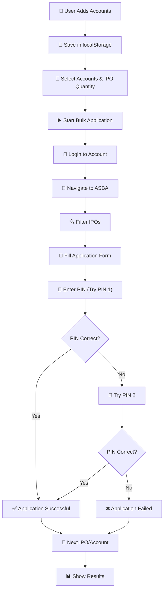

# IPO Bulk Applier 📈

[](https://nodejs.org)
[](https://expressjs.com)
[](https://pptr.dev)
[](https://getbootstrap.com)
[](LICENSE)

A powerful, production-ready web application for automating bulk IPO applications on Mero Share (meroshare.cdsc.com.np). Manage multiple accounts and apply to multiple IPOs simultaneously with error tracking and real-time progress updates.

🌐 **Live Demo**: Coming soon on Vercel  
📖 **Full Documentation**: [See DEPLOYMENT.md](DEPLOYMENT.md) for deployment guides  
🤝 **Contributing**: See [CONTRIBUTING.md](CONTRIBUTING.md)

## ✨ Features

### 🏢 Account Management
- ✅ Add and manage multiple Mero Share accounts
- ✅ Edit and delete accounts securely
- ✅ Browser localStorage persistence (no database required)
- ✅ Masked sensitive data in UI

### 🚀 Bulk IPO Application
- ✅ Apply to multiple IPOs across multiple accounts automatically
- ✅ Smart PIN retry logic (tries PIN 1, then PIN 2 if fails)
- ✅ Real-time progress tracking with status updates
- ✅ Success verification via application button state detection
- ✅ Detailed error messages for failed applications
- ✅ Automatic CRN extraction from account number

### 💻 User Interface
- ✅ Bootstrap 5 responsive design
- ✅ Modern tabbed interface (Manage Accounts / Bulk Apply)
- ✅ Real-time progress updates with live status
- ✅ Detailed results with per-IPO success/failure details
- ✅ Mobile-friendly responsive layout
- ✅ Clear error messages and user feedback

### 🔒 Security & Reliability
- ✅ Client-side password storage in localStorage
- ✅ HTTPS recommended in production
- ✅ Input validation and error handling
- ✅ Graceful failure with detailed error reporting

## 🚀 Quick Start

### Prerequisites
- Node.js v16+
- npm or yarn
- Mero Share account credentials

### Local Development (5 minutes)

```bash
# 1. Clone repository
git clone https://github.com/yourusername/ipo-bulk-applier.git
cd ipo-bulk-applier

# 2. Install dependencies
npm install

# 3. Start server
npm start

# 4. Open browser
# Navigate to http://localhost:3000
```

### Docker (Alternative)

```bash
# Build and run with Docker
docker-compose up

# App available at http://localhost:3000
```

## 📖 Usage Guide

### 1️⃣ Add Accounts

**Tab: "Manage Accounts"**

| Field | Example | Notes |
|-------|---------|-------|
| **Account Name** | Mom's Account | Friendly name for reference |
| **DP ID** | 18200 | Depository Participant number |
| **Username** | user@example.com | Mero Share username |
| **Password** | ••••••••• | Your Mero Share password |
| **CRN Number** | 08314100719564000001 | Full 20-digit account number |
| **PIN 1** | 1234 | Primary transaction PIN |
| **PIN 2** | 6789 | Backup transaction PIN (optional) |

```javascript
// CRN is extracted automatically from digits 6-14:
Account: 08314100719564000001
         ______CRN________
CRN:           00719564    (chars 6-14)
```

### 2️⃣ Bulk Apply

**Tab: "Bulk Apply"**

1. Select accounts to apply for ☑️
2. Enter IPO quantity (number of units)
3. Click "Start Bulk Application" ▶️
4. Monitor real-time progress 📊
5. View detailed results ✓/✗

**Application Flow:**
```
Login to Account
    ↓
Navigate to ASBA page
    ↓
Filter IPOs (IPO + Ordinary Shares)
    ↓
For Each IPO:
├─ Select Bank
├─ Select Account
├─ Enter Quantity
├─ Enter CRN (auto-extracted)
├─ Proceed to PIN page
├─ Try PIN 1
├─ If fails: Try PIN 2
├─ Verify success (button state change)
└─ Return to ASBA
    ↓
Complete & Show Results
```

## 🏗️ Project Structure

```
ipo-bulk-applier/
├── 📄 server.js                 # Express backend, API endpoints
├── 🤖 automation.js             # Puppeteer core automation logic
├── 📁 public/
│   ├── index.html              # Frontend interface
│   ├── app.js                  # Frontend API calls & logic
│   └── style.css               # Styling
├── 📦 package.json             # Dependencies & scripts
├── 🐳 Dockerfile               # Docker configuration
├── 📋 docker-compose.yml       # Docker Compose setup
├── ✅ vercel.json              # Vercel deployment config
├── 🔐 .env.example             # Environment variables template
├── 📝 README.md                # This file
├── 📖 DEPLOYMENT.md            # Deployment guides
├── 🤝 CONTRIBUTING.md          # Contributing guidelines
├── 📄 LICENSE                  # ISC License
└── 📜 .gitignore               # Git ignore rules
```

## 🔌 API Endpoints

### Account Management

```bash
# List all accounts
GET /api/accounts

# Add new account
POST /api/accounts
Content-Type: application/json

{
  "name": "My Account",
  "dp": 18200,
  "username": "user@example.com",
  "password": "password",
  "crn_number": "08314100719564000001",
  "pin_1": "2227",
  "pin_2": "6406"
}

# Update account
PUT /api/accounts/:id
Content-Type: application/json

# Delete account
DELETE /api/accounts/:id
```

### IPO Application

```bash
# Start bulk application
POST /api/apply-ipo
Content-Type: application/json

{
  "accountIds": ["account-1", "account-2"],
  "quantity": 10
}

# Response:
{
  "processId": "uuid-string",
  "status": "running"
}

# Check status
GET /api/status/:processId

# Response:
{
  "status": "running" | "completed" | "error",
  "processed": 1,
  "total": 2,
  "current_account_status": "Processing account: Mom"
}

# Get results
GET /api/results/:processId

# Response:
{
  "status": "completed",
  "total": 2,
  "processed": 2,
  "results": [
    {
      "account_name": "Mom's Account",
      "account_id": "acc-1",
      "total_ipos": 2,
      "successful": 1,
      "failed": 1,
      "ipo_results": [
        {
          "ipo": "Company Name",
          "status": "success" | "failed",
          "quantity": 10,
          "error": null
        }
      ]
    }
  ]
}
```

## 🛠️ Technical Stack

| Component | Technology | Version |
|-----------|-----------|---------|
| **Runtime** | Node.js | 18+ |
| **Backend** | Express.js | 4.18.2 |
| **Automation** | Puppeteer | 24.42.0 |
| **Frontend** | Bootstrap | 5.x |
| **Storage** | Browser localStorage | Native |
| **Utilities** | UUID | 9.0.0 |

## 📊 Workflow Diagram



## ⚙️ Configuration

### Environment Variables (.env)

```env
# Server
NODE_ENV=production
PORT=3000

# Optional
LOG_LEVEL=info
DEBUG=false
```

### Puppeteer Options

Located in `automation.js`:
```javascript
const browser = await puppeteer.launch({
  headless: false,           // Show browser window
  defaultViewport: null,     // Use full screen
  args: ['--start-maximized'] // Maximize window
});
```

## 🌐 Deployment Options

### ⚡ Vercel (Recommended for beginners)
- 1-click deployment from GitHub
- Automatic SSL/HTTPS
- Free tier available
- See [DEPLOYMENT.md](DEPLOYMENT.md#2-vercel-deployment-)

### 🚂 Railway
- Simple deployment
- Real-time logs
- Auto-deploy on push
- See [DEPLOYMENT.md](DEPLOYMENT.md#4-railway-deployment-)

### 🐳 Docker
- Self-hosted option
- Deploy anywhere
- Consistent environment
- See [DEPLOYMENT.md](DEPLOYMENT.md#3-docker-deployment-)

### 🔵 Heroku / AWS / GCP
- Full control
- Scalable
- See [DEPLOYMENT.md](DEPLOYMENT.md) for details

## 🔐 Security Considerations

✅ **Implemented:**
- Client-side password storage in localStorage
- Input validation on backend
- Error message filtering (no credential leaks)
- HTTPS recommended in production

⚠️ **Best Practices:**
- Never commit `.env` file (use `.env.example`)
- Use HTTPS in production
- Keep passwords secure
- Review code before deployment
- Don't expose API to untrusted networks

## 🐛 Troubleshooting

| Problem | Solution |
|---------|----------|
| **Port 3000 already in use** | `PORT=3001 npm start` |
| **Chrome not found** | `npm install puppeteer` |
| **Accounts not persisting** | Check browser localStorage settings |
| **Application fails at login** | Verify Mero Share website is accessible |
| **PIN verification fails** | Check PIN 1 and PIN 2 are correct |

See [DEPLOYMENT.md](DEPLOYMENT.md#troubleshooting) for more solutions.

## 📈 Performance Tips

- **Concurrent Accounts**: Process 1-2 simultaneously for stability
- **Memory Usage**: Each browser instance uses ~150MB
- **CPU Usage**: Minimize other processes during bulk operations
- **Network**: Use stable internet connection
- **Timing**: Avoid market peak hours

## 📚 File Descriptions

| File | Purpose |
|------|---------|
| `server.js` | Express backend, API routes, account management |
| `automation.js` | Puppeteer browser automation, IPO application logic |
| `public/index.html` | HTML interface, forms, progress display |
| `public/app.js` | Frontend logic, API calls, localStorage sync |
| `public/style.css` | Custom styling, responsive design |
| `package.json` | Dependencies, npm scripts |
| `vercel.json` | Vercel-specific configuration |
| `Dockerfile` | Docker image definition |
| `docker-compose.yml` | Docker Compose orchestration |

## 🚧 Error Handling

The app handles multiple error scenarios:

```
❌ Invalid Login
   → Shows error message
   → Doesn't proceed to ASBA

❌ Wrong PIN (First Attempt)
   → Automatically tries PIN 2
   → If PIN 2 correct → Success
   → If PIN 2 wrong → Mark as Failed

❌ Network Error
   → Logs detailed error
   → Shows error in results
   → Allows retry

❌ Form Validation
   → Checks all fields filled
   → Validates account exists
   → Shows clear error message
```

## 📊 Results Format

```javascript
{
  status: "completed",
  total: 2,
  processed: 2,
  results: [
    {
      account_name: "Mom's Account",
      account_id: "f47ac10b-58cc",
      total_ipos: 2,
      successful: 1,
      failed: 1,
      ipo_results: [
        {
          ipo: "Yambaling Hydropower Limited",
          status: "success",
          quantity: 10,
          error: null
        },
        {
          ipo: "Himalayan Development Bank",
          status: "failed",
          quantity: 10,
          error: "You have entered wrong transaction PIN"
        }
      ]
    }
  ]
}
```

## 🤝 Contributing

We welcome contributions! See [CONTRIBUTING.md](CONTRIBUTING.md) for:
- How to set up development environment
- Code style guidelines
- Testing requirements
- Pull request process

## 📄 License

This project is licensed under the **ISC License** - see [LICENSE](LICENSE) file.

### Disclaimer

⚠️ **Use at Your Own Risk**

This tool is for educational and personal automation purposes:
- You are responsible for your Mero Share account security
- Follow Mero Share's terms of service and policies
- Ensure you meet IPO eligibility requirements
- Verify all applications are correct after automation
- The authors are not responsible for any losses or issues

## 🎯 Roadmap

- [ ] Email/SMS notifications on completion
- [ ] Historical application reports
- [ ] IPO calendar integration
- [ ] Advanced filtering options
- [ ] Multi-user authentication
- [ ] API rate limiting
- [ ] Application retry with exponential backoff
- [ ] Export to PDF/Excel

## 💬 Support & Questions

- 🐛 **Report Bugs**: [GitHub Issues](https://github.com/yourusername/ipo-bulk-applier/issues)
- 💬 **Ask Questions**: [GitHub Discussions](https://github.com/yourusername/ipo-bulk-applier/discussions)
- 📧 **Email**: Contact maintainers

## 📞 Quick Links

- [📖 Full Deployment Guide](DEPLOYMENT.md)
- [🤝 Contributing Guidelines](CONTRIBUTING.md)
- [📜 License](LICENSE)
- [🔐 Security Policy](SECURITY.md) (coming soon)

---

<div align="center">

**Made with ❤️ for Mero Share users**

⭐ Star this repository if you find it helpful!

[GitHub](https://github.com/yourusername/ipo-bulk-applier) • [Issues](https://github.com/yourusername/ipo-bulk-applier/issues) • [Discussions](https://github.com/yourusername/ipo-bulk-applier/discussions)

</div>

